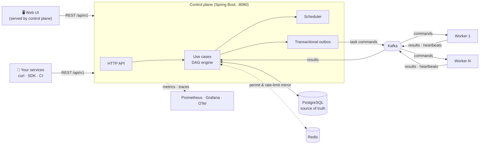

<div align="center">

# ⚙️ FlowForge

### Distributed workflow orchestration that doesn't lose work — even when everything else fails.

Design a DAG of tasks, publish it, hit **Start**, and watch FlowForge fan work out across
horizontally scalable workers with durable at-least-once delivery, duplicate suppression, retries,
schedules, rate limits, tenant isolation, and full observability.

[](https://github.com/RAVImitte/FlowForge/actions/workflows/ci.yml)


[Quick start](#-quick-start-5-minutes) •
[UI demo](#-guided-demo-with-the-web-ui) •
[Integrate](#-integration-guide) •
[Architecture](#-architecture) •
[API](#api-reference) •
[Docs](#-documentation)

</div>

---

## ✨ Why FlowForge?

| | |
|---|---|
| 🧩 **DAG-native** | Linear, fan-out, fan-in, and mixed graphs validated as acyclic before they can run. Published versions are immutable. |
| 🛡️ **Never loses work** | PostgreSQL is the source of truth. Transactional outbox + inbox, fencing tokens, and leases survive broker, worker, and control-plane crashes. |
| 🔁 **Safe to retry everything** | Idempotent starts (`Idempotency-Key`), duplicate-suppressed results, optimistic locking via `ETag`/`If-Match`. |
| 📈 **Scales horizontally** | Workers and control-plane replicas scale with Kafka partitions; `FOR UPDATE SKIP LOCKED` keeps claims disjoint. |
| ⏰ **Schedules built in** | One-time and cron schedules with IANA time zones and explicit misfire policies. |
| 🚦 **Back-pressure** | Per-workflow and per-task concurrency limits, token-bucket rate limits, and HTTP 429 + `Retry-After`. |
| 🏢 **Multi-tenant & secure** | OAuth 2.0 JWT, role-based access, tenant quotas, secret references, append-only audit log. |
| 🔭 **Observable** | Prometheus metrics, OpenTelemetry traces, ECS JSON logs, a Grafana dashboard, and SLO burn-rate alerts. |
| 🖥️ **Built-in web UI** | Create workflows visually, preview the DAG, start executions, and watch tasks light up live. |

---

## 🏗 Architecture



**Life of an execution**

1. A workflow is created as a **draft**, then **published** as an immutable version.
2. Starting an execution materializes root tasks as `READY` and dependents as `BLOCKED`.
3. Ready tasks are written to the outbox in the same transaction, then published to Kafka.
4. A worker claims the command, runs the handler (`NOOP`, `DELAY`, `FAIL`, or your own), and publishes a result.
5. The control plane applies the result atomically, unblocks dependents, and appends to the event journal.
6. Repeat until the workflow is `SUCCEEDED`, `FAILED`, or `CANCELLED`.

---

## 🚀 Quick start (5 minutes)

**You need:** Java 21 and a Docker-compatible runtime (Docker Desktop, Rancher Desktop/Moby, Podman). The Maven wrapper downloads Maven for you.

FlowForge runs in two modes:

| Mode | What runs | Best for |
|---|---|---|
| **Lite** | PostgreSQL + control plane (tasks execute in-process) | Fast UI demos, API exploration |
| **Distributed** | PostgreSQL + Kafka + Redis + control plane + N workers | Realistic demos, scaling, failure drills |

### Lite mode

```powershell
git clone https://github.com/RAVImitte/FlowForge.git
cd FlowForge
docker compose up -d postgres
.\mvnw.cmd -pl flowforge-control-plane -am spring-boot:run
```

On macOS/Linux use `./mvnw` instead of `.\mvnw.cmd`.

When you see `Started FlowForgeApplication`, open **http://localhost:8080** 🎉

### Distributed mode

```powershell
docker compose up -d postgres kafka redis

# Terminal 1 — control plane
$env:SPRING_PROFILES_ACTIVE = 'production'
$env:FLOWFORGE_SECURITY_ENABLED = 'false'   # local only; see Integration guide for JWT
.\mvnw.cmd -pl flowforge-control-plane -am spring-boot:run

# Terminal 2 — worker (start more on other ports to scale out)
$env:SPRING_PROFILES_ACTIVE = 'production'
.\mvnw.cmd -pl flowforge-worker -am spring-boot:run

# Optional — dashboards
docker compose --profile observability up -d prometheus grafana otel-collector
```

| Service | URL |
|---|---|
| Web UI | http://localhost:8080 |
| Control-plane health | http://localhost:8080/actuator/health |
| Worker health | http://localhost:8081/actuator/health |
| Prometheus | http://localhost:9090 |
| Grafana (FlowForge dashboard) | http://localhost:3000 |

To add a second worker: `$env:WORKER_PORT = '8082'` in a new terminal before starting it.

> ⚠️ The web UI does not send bearer tokens, so it is intended for local/demo use with
> `FLOWFORGE_SECURITY_ENABLED=false`. With security enabled, only the REST API (with a JWT) is reachable.

---

## 🎬 Guided demo with the web UI

The control plane serves a Bootstrap UI with live DAG visualization at **http://localhost:8080**.

| Page | Path | What you can do |
|---|---|---|
| Dashboard | `/` | Workflow stats, workflow list, recent executions, archive |
| New workflow | `/workflow/create.html` | Add tasks and dependencies with a live DAG preview |
| Workflow detail | `/workflow/detail.html?id=…` | Inspect tasks/dependencies, **Publish**, **Start execution** |
| Executions | `/executions/index.html` | Filter by status; auto-refreshes every 3 s |
| Execution detail | `/execution/detail.html?id=…` | Color-coded DAG, task runs, attempts, event log, **Cancel** |

### Scene 1 — The happy path: an order pipeline (fan-out / fan-in)

1. Open **New Workflow** and enter:
   - **Name:** `Order processing demo`
   - **Max concurrent executions:** `5`
2. Click **Add Task** five times and fill them in:

   | Key | Name | Type | Configuration |
   |---|---|---|---|
   | `VALIDATE_ORDER` | Validate order | `NOOP` | `{}` |
   | `CHARGE_PAYMENT` | Charge payment | `DELAY` | `{"durationMs": 4000}` |
   | `RESERVE_STOCK` | Reserve stock | `DELAY` | `{"durationMs": 6000}` |
   | `SHIP_ORDER` | Ship order | `DELAY` | `{"durationMs": 3000}` |
   | `NOTIFY_CUSTOMER` | Notify customer | `NOOP` | `{}` |

3. Click **Add Dependency** and connect them. Watch the **DAG Preview** draw the diamond:

   | Task | Depends on |
   |---|---|
   | `CHARGE_PAYMENT` | `VALIDATE_ORDER` |
   | `RESERVE_STOCK` | `VALIDATE_ORDER` |
   | `SHIP_ORDER` | `CHARGE_PAYMENT` |
   | `SHIP_ORDER` | `RESERVE_STOCK` |
   | `NOTIFY_CUSTOMER` | `SHIP_ORDER` |

   ```mermaid
   flowchart LR
       VALIDATE_ORDER --> CHARGE_PAYMENT --> SHIP_ORDER
       VALIDATE_ORDER --> RESERVE_STOCK --> SHIP_ORDER
       SHIP_ORDER --> NOTIFY_CUSTOMER
   ```

4. Click **Create Workflow**. On the detail page the version is a **DRAFT**; click **Publish**.
5. Click **Start Execution**. The modal pre-fills an **Idempotency Key** — click **Start**.
6. On the execution page, watch the DAG update every 3 seconds:
   `VALIDATE_ORDER` completes → `CHARGE_PAYMENT` and `RESERVE_STOCK` run **in parallel** →
   `SHIP_ORDER` waits for **both** (fan-in) → `NOTIFY_CUSTOMER` → workflow **SUCCEEDED** ✅
7. Scroll the **Event Log** to see every state transition recorded in order.

### Scene 2 — Idempotency: start the same thing twice

The UI generates a fresh key every time, so show this one from a terminal. Copy the workflow ID from the
browser address bar (`detail.html?id=…`) and run:

```powershell
$id = '<workflow-id>'
1..2 | ForEach-Object {
    (Invoke-RestMethod -Method Post -Uri "http://localhost:8080/api/v1/workflows/$id/executions" `
        -Headers @{ 'Idempotency-Key' = 'demo-order-42' }).id
}
```

Both calls print the **same** execution ID, and the Executions page shows only one new run. That is
exactly what a client retrying after a network timeout needs.

### Scene 3 — Failure handling

Create a workflow `Failure demo` with:

| Key | Type | Configuration | Depends on |
|---|---|---|---|
| `STEP_ONE` | `NOOP` | `{}` | — |
| `BROKEN_STEP` | `FAIL` | `{"errorCode": "PAYMENT_DECLINED", "message": "Card declined"}` | `STEP_ONE` |
| `NEVER_RUNS` | `NOOP` | `{}` | `BROKEN_STEP` |

Publish and start it. The **Attempts** table shows `PAYMENT_DECLINED`, the workflow ends **FAILED**,
and `NEVER_RUNS` is never dispatched.

### Scene 4 — Cancellation

Create a workflow with two chained `DELAY` tasks of `{"durationMs": 15000}`, start it, and press
**Cancel** while the first task runs. The workflow moves to `CANCELLING`, lets the in-flight task finish,
then settles on `CANCELLED` — the second task is never dispatched.

### Scene 5 — Kill a worker (distributed mode)

Run two workers, start the order pipeline, and stop one worker (<kbd>Ctrl</kbd>+<kbd>C</kbd>) while
`DELAY` tasks are running. The stopping worker drains its in-flight task, Kafka rebalances its partitions
to the survivor, and the execution still finishes. Kill a worker process hard instead and its attempt lease
expires and is recovered by the retry policy. Open Grafana at http://localhost:3000 to watch throughput,
backlog age, and retries while it happens.

> 💡 **Demo tips:** keep the Executions page open on a second screen — it auto-refreshes. Use
> `DELAY` durations of 3–10 s so the audience can see tasks transition; the maximum is 60 s.

---

## 🔌 Integration guide

Everything the UI does is a plain REST call under `/api/v1`, so any language or CI system can drive FlowForge.

### 1. Create → publish → start → poll

**PowerShell**

```powershell
$base = 'http://localhost:8080/api/v1'
$body = @{
    name  = 'Nightly report'
    tasks = @(
        @{ key = 'EXTRACT';   name = 'Extract';   type = 'DELAY'; configuration = @{ durationMs = 2000 } }
        @{ key = 'TRANSFORM'; name = 'Transform'; type = 'NOOP';  configuration = @{} }
    )
    dependencies = @(@{ taskKey = 'TRANSFORM'; dependsOnTaskKey = 'EXTRACT' })
} | ConvertTo-Json -Depth 5

$wf = Invoke-RestMethod -Method Post -Uri "$base/workflows" -ContentType 'application/json' -Body $body
Invoke-RestMethod -Method Post -Uri "$base/workflows/$($wf.id)/publish" -Headers @{ 'If-Match' = "`"$($wf.lockVersion)`"" }

$exec = Invoke-RestMethod -Method Post -Uri "$base/workflows/$($wf.id)/executions" -Headers @{ 'Idempotency-Key' = 'report-2026-10-01' }
do { Start-Sleep 1; $exec = Invoke-RestMethod "$base/executions/$($exec.id)" } until ($exec.status -in 'SUCCEEDED','FAILED','CANCELLED')
$exec.status
```

**bash / curl**

```bash
BASE=http://localhost:8080/api/v1
WF=$(curl -s -X POST $BASE/workflows -H 'Content-Type: application/json' -d '{
  "name": "Nightly report",
  "tasks": [
    {"key": "EXTRACT",   "name": "Extract",   "type": "DELAY", "configuration": {"durationMs": 2000}},
    {"key": "TRANSFORM", "name": "Transform", "type": "NOOP",  "configuration": {}}
  ],
  "dependencies": [{"taskKey": "TRANSFORM", "dependsOnTaskKey": "EXTRACT"}]
}' | jq -r .id)

curl -s -X POST $BASE/workflows/$WF/publish -H 'If-Match: "0"'
EXEC=$(curl -s -X POST $BASE/workflows/$WF/executions -H 'Idempotency-Key: report-2026-10-01' | jq -r .id)
curl -s $BASE/executions/$EXEC | jq '{status, tasks: [.tasks[] | {taskKey, status}]}'
```

The workflow you created via the API shows up immediately in the web UI.

### 2. Rules every client should follow

| Concern | Contract |
|---|---|
| **Starting executions** | Always send `Idempotency-Key`. Reusing a key for the same workflow returns the existing execution, so retries are safe. |
| **Mutations** | `PUT`, `publish`, `DELETE`, and schedule changes require `If-Match: "<lockVersion>"` from the latest `ETag`. A stale value is rejected instead of silently overwriting. |
| **Back-pressure** | HTTP `429` means capacity is saturated. Wait for the `Retry-After` header, then retry with the **same** idempotency key. |
| **Errors** | Failures are RFC 7807 problem responses (`title`, `detail`, `violations`). |
| **Tracing** | Send `X-Correlation-Id` to link your logs with FlowForge's; the effective ID is echoed back. |
| **Task side effects** | Delivery is at least once. External side effects should use the command event ID as their own idempotency key. |

### 3. Retries and timeouts per task

Add a `reliabilityPolicy` to any task (API only; the UI uses the single-attempt default):

```json
{
  "key": "CALL_PARTNER_API",
  "name": "Call partner API",
  "type": "DELAY",
  "configuration": {"durationMs": 500},
  "maxConcurrency": 5,
  "reliabilityPolicy": {
    "maxAttempts": 5,
    "initialBackoffMs": 1000,
    "backoffMultiplier": 2.0,
    "maxBackoffMs": 30000,
    "jitterFactor": 0.2,
    "attemptTimeoutMs": 10000
  }
}
```

### 4. Schedule workflows

Schedules require the scheduler, which is enabled in the `production` profile (or set `FLOWFORGE_SCHEDULING_ENABLED=true`).
Cron expressions use six fields (`sec min hour day month weekday`).

```bash
# Every weekday at 02:00 Kolkata time
curl -X POST $BASE/schedules -H 'Content-Type: application/json' -d "{
  \"workflowId\": \"$WF\",
  \"type\": \"CRON\",
  \"cronExpression\": \"0 0 2 * * MON-FRI\",
  \"timeZone\": \"Asia/Kolkata\",
  \"misfirePolicy\": \"FIRE_ONCE\"
}"

# One-time run
curl -X POST $BASE/schedules -H 'Content-Type: application/json' \
  -d "{\"workflowId\": \"$WF\", \"type\": \"ONE_TIME\", \"fireAt\": \"2026-12-31T18:30:00Z\"}"
```

`misfirePolicy` is `FIRE_ONCE` (run one catch-up) or `SKIP` (record the miss and move on).

### 5. Add your own task type

Workers discover handlers as Spring beans. Drop a class into `flowforge-worker` and reference its type in your workflow:

```java
@Component
public class SendEmailTaskHandler implements WorkerTaskHandler {
    @Override
    public String taskType() {
        return "SEND_EMAIL";
    }

    @Override
    public WorkerTaskResult execute(TaskExecutionContext context) {
        var config = context.command().configuration();
        String apiKey = context.secrets().get("apiKey");      // resolved only inside the worker
        // Use context.idempotencyToken() as the provider's idempotency key.
        try {
            // ... call your email provider ...
            return WorkerTaskResult.succeeded();
        } catch (TransientProviderException e) {
            return WorkerTaskResult.retryableFailure("PROVIDER_UNAVAILABLE", e.getMessage());
        }
    }
}
```

Secrets are never stored inline. Declare a reference on the task and the worker resolves it at run time:

```json
"secretReferences": { "apiKey": { "provider": "env", "name": "EMAIL_API_KEY" } }
```

> Custom handlers run in **distributed mode** (worker process). Lite mode only ships the built-in `NOOP`, `DELAY`, and `FAIL` handlers.

### 6. Secure it for real environments

Keep `FLOWFORGE_SECURITY_ENABLED=true` (the `production` default) and point FlowForge at your OIDC provider (Keycloak, Entra ID, Auth0, …):

```powershell
$env:FLOWFORGE_OIDC_ISSUER_URI  = 'https://identity.example.com/realms/flowforge'
$env:FLOWFORGE_OIDC_JWK_SET_URI = 'https://identity.example.com/realms/flowforge/protocol/openid-connect/certs'
```

Call the API with `Authorization: Bearer <jwt>`. The token's `roles` claim drives access and its `tenant_id` claim scopes all data:

| Role | Can |
|---|---|
| `VIEWER` | Read workflows, executions, schedules |
| `OPERATOR` | Viewer + start/cancel executions, pause/resume schedules |
| `ADMIN` | Everything, including workflow/schedule changes, quotas, audit log, DLQ replay |
| `MONITOR` | Scrape `/actuator/prometheus` |

### 7. Deploy to Kubernetes

```powershell
.\scripts\build-images.ps1 -Registry <your-registry> -Tag 1.0.0
helm lint .\deploy\helm\flowforge --strict
helm upgrade --install flowforge .\deploy\helm\flowforge --namespace flowforge --create-namespace
```

Create the database, Kafka, Redis, and OIDC Secrets first — images run as non-root (UID 10001) and read all
credentials from external Kubernetes Secrets. The [Helm deployment guide](deploy/helm/flowforge/README.md) lists
the required Secret contract, values, autoscaling constraints, and rollback commands.

---

## 📋 Feature catalog

<details>
<summary><b>Show all capabilities (100+)</b></summary>

- Create, retrieve, list, update, publish, and archive workflow definitions
- Model task dependencies as a validated directed acyclic graph
- Preserve immutable published versions while allowing a new draft
- Prevent lost updates with strong ETags and `If-Match`
- Apply schema changes with Flyway
- Expose liveness, readiness, metrics, and application information
- Verify domain, HTTP, architecture, migration, and persistence behavior
- Start executions from immutable published workflow versions
- Materialize root tasks as ready and dependent tasks as blocked
- Resolve linear, fan-out, fan-in, and mixed DAGs as tasks complete
- Claim ready work safely across instances with `FOR UPDATE SKIP LOCKED`
- Make duplicate starts and task-completion reports idempotent
- Persist task attempts and an ordered execution-event journal
- Cancel workflows without dispatching additional dependent work
- Recover durable ready work through the startup and scheduled dispatch loop
- Execute deterministic `NOOP`, `DELAY`, and `FAIL` handlers in independently scalable workers
- Share framework-light, versioned Kafka command and event contracts
- Provision versioned task-command, task-result, task-heartbeat, and execution-event topics
- Run independently deployable workers with Kafka and worker health checks
- Start a single-node Kafka 4.3 KRaft broker through the local Compose environment
- Persist task commands and execution events through a PostgreSQL transactional outbox
- Claim outbox batches safely across control-plane instances with short, recoverable leases
- Publish stable event IDs, record keys, correlation headers, and versioned JSON envelopes to Kafka
- Recover broker failures, acknowledgement uncertainty, and publisher crashes without message loss
- Expose outbox publication, failure, stale-acknowledgement, and pending-backlog metrics
- Consume task commands through the shared `flowforge-workers-v1` Kafka consumer group
- Persist commands before execution and acknowledge Kafka only after durable completion
- Suppress completed-command duplicates through a durable inbox and stable event IDs
- Commit task completion and a durable result-outbox row atomically
- Publish task results through recoverable, token-fenced PostgreSQL claims
- Scale workers horizontally through Kafka partition assignment
- Consume task results through the `flowforge-control-plane-results-v1` Kafka group
- Apply result inbox records, task transitions, DAG advancement, events, and downstream commands atomically
- Reject stale state versions, mismatched task identities, unknown attempts, and reused event IDs
- Suppress duplicate and concurrent equivalent results without advancing the DAG twice
- Fence every distributed task attempt with a unique token and renewable PostgreSQL lease
- Publish worker heartbeats while handlers run and ingest them idempotently
- Recover orphaned attempts through the durable retry policy with multi-replica-safe lease claims
- Reject delayed heartbeats and results from workers replaced after lease expiry
- Retry poison command, result, and heartbeat records with bounded exponential backoff
- Route exhausted poison records to separate versioned DLQ topics without losing raw payloads or correlation metadata
- Require broker acknowledgement of each DLQ publication before recovering the source offset
- Emit durable `TASK_DEAD_LETTERED` events when task retries are exhausted
- Define one-time and recurring cron schedules with explicit IANA time zones and misfire policies
- Persist schedule definitions and trigger-history foundations in PostgreSQL
- Create, inspect, list, update, pause, resume, and soft-delete schedules through versioned HTTP APIs
- Fence concurrent schedule mutations with strong ETags and `If-Match`
- Materialize due fires in bounded, disjoint PostgreSQL batches across scheduler replicas
- Start scheduled workflows with deterministic logical-fire idempotency keys
- Recover abandoned trigger processing through token-fenced leases and delayed retries
- Catch up once or skip stale occurrences according to an explicit misfire policy and threshold
- Complete one-time schedules and durably advance recurring schedules to their next future occurrence
- Serialize coordination capacity through a PostgreSQL-authoritative permit ledger
- Mirror short-lived permits into Redis with atomic Lua acquire, renew, release, and replacement operations
- Namespace and hash Redis keys while bounding every coordination key with a TTL
- Continue safely through Redis outages and reconstruct ephemeral state from PostgreSQL after key loss
- Persist optional per-workflow-version and per-task concurrency limits with workflow definitions
- Serialize workflow admission and task dispatch across replicas through PostgreSQL-authoritative permits
- Leave saturated tasks durably `READY` and return HTTP 429 for saturated workflow admission
- Release task permits on success, failure, retry, cancellation, timeout, and orphan-lease recovery paths
- Renew active permits, retire leaked ownership, and rebuild Redis state from active PostgreSQL executions
- Expose bounded workflow rejection, task deferral, permit lifecycle, and reconciliation metrics
- Enforce PostgreSQL-authoritative token buckets across scheduler and task-dispatch replicas
- Mirror versioned token-bucket state into TTL-bounded Redis keys and rebuild it after key loss
- Bound pending schedule triggers and per-workflow ready-task queues before resource exhaustion
- Delay schedule fires and task claims when rate capacity is exhausted without losing durable work
- Return HTTP 429 overload responses with explicit `Retry-After` guidance
- Expose saturation, throttling, queue-depth, queue-age, and rejected-admission metrics
- Rebalance Kafka consumers cooperatively while allowing bounded in-flight handlers to finish during graceful shutdown
- Recover an abandoned schedule through control-plane and worker replacement while reconstructing active permit mirrors after total Redis key loss
- Operate scheduling and coordination through a dedicated runbook and an accepted architecture decision record
- Scope consistent workflow, task, attempt, event, fencing, and Kafka metadata into leak-safe structured log context
- Accept safe `X-Correlation-Id` request identifiers, generate replacements for unsafe values, and echo the effective ID
- Emit ECS JSON console logs in production profiles while retaining readable local and test output
- Trace HTTP, Kafka, scheduled workflow processing, and worker execution with Micrometer and OpenTelemetry
- Preserve bounded W3C trace and baggage context across PostgreSQL-backed outbox delays and process restarts
- Keep OTLP export opt-in and independent from workflow transactions and Kafka acknowledgements
- Expose Prometheus-format application, JVM, HTTP, workflow-throughput, backlog-age, scheduling, and saturation metrics
- Provision a versioned Grafana operations dashboard and local Prometheus/OpenTelemetry Collector stack
- Evaluate API-availability and workflow-start error budgets with multi-window burn-rate alerts
- Alert on durable queue/completion age, outbox stalls, retries, timeouts, dead letters, permit leaks, admission pressure, and dependency loss with linked runbooks
- Authenticate production API requests as issuer-validated OAuth 2.0 JWT bearer tokens
- Enforce deny-by-default `VIEWER`, `OPERATOR`, `ADMIN`, and `MONITOR` role boundaries
- Keep health probes public while protecting metrics and administrative actuator endpoints
- Return stable problem responses for missing credentials and forbidden operations
- Derive bounded tenant identity from validated JWT claims while ignoring spoofable tenant headers
- Backfill durable workflow, execution, and schedule ownership through a versioned tenant-registry migration
- Persist optimistic-versioned tenant quotas for executions, tasks, schedules, ready queues, and admission rates
- Enforce tenant capacity through PostgreSQL-authoritative locks across control-plane replicas while treating Redis as a recoverable mirror
- Administer the authenticated tenant's quota with ETags and stale-writer fencing
- Reject inline task secrets and carry provider-neutral secret references through PostgreSQL and Kafka without resolved material
- Resolve secret references only inside workers and redact sensitive handler failures before logs, traces, events, or durable details
- Record fail-closed, append-only administrative audit attempt/outcome pairs with tenant, actor, action, target, and request identity
- Query tenant-scoped audit history through an administrator-only API with a configurable online retention window
- Build provenance-enabled control-plane and worker images from digest-pinned Java 21 bases with deterministic artifact timestamps
- Run both images as UID/GID 10001 with health checks and no writable application directory
- Deploy independently scalable control-plane and worker workloads through a versioned Helm chart
- Protect Kubernetes rollouts with startup/liveness/readiness probes, graceful drains, disruption budgets, resources, and topology spread
- Enforce restricted pod/container security contexts and source database, Kafka, Redis, OIDC, and trust-store material only from external Secrets
- Gate pull requests and releases with architecture, security/tenant-isolation, upgrade/rollback, recovery, distributed-integration, manifest, SBOM, vulnerability, smoke, provenance, signing, and attestation checks

Phases 1-7 are complete. The final same-revision acceptance matrix proves security and tenant isolation, populated-schema upgrade and rollback compatibility, logical restore, named-point WAL/PITR, Redis reconstruction, bounded tenant-safe DLQ replay, the full distributed reactor, deployment manifests, and aggregate SBOM generation. Publication remains an authorized action through the protected release workflow.

</details>

---

## 🧪 Testing and load

```powershell
.\mvnw.cmd verify                                   # unit, architecture, migration, and integration tests
.\scripts\run-load-test.ps1 -Profile smoke          # against a running distributed topology
.\scripts\run-load-topology.ps1 -Topology balanced-2x2-6p -Profile smoke   # build, start, measure, clean up
.\scripts\verify-observability.ps1                  # Prometheus rules, alerts, and Compose profile
```

Integration tests use PostgreSQL, Kafka, and Redis Testcontainers and are skipped when no Docker-compatible
runtime is available. The [load-testing guide](load-testing/README.md) covers smoke, overload, soak, and scheduled
profiles and the JSON report contract.

The `production` profile enables Kafka, outbox publication, command dispatch, result consumption, scheduling,
coordination, and JWT security, and disables the in-process dispatcher. Startup validation rejects incomplete
execution topologies and missing security configuration. To export traces to the local collector, set
`$env:FLOWFORGE_OTLP_ENABLED = 'true'` before starting each application.

---

## ⚙️ Configuration

All settings are environment variables with sensible local defaults.

<details>
<summary><b>Show all environment variables</b></summary>

| Environment variable | Default |
|---|---|
| `FLOWFORGE_DB_URL` | `jdbc:postgresql://localhost:5432/flowforge` |
| `FLOWFORGE_DB_USERNAME` | `flowforge` |
| `FLOWFORGE_DB_PASSWORD` | `flowforge` |
| `FLOWFORGE_DB_POOL_SIZE` | `10` |
| `FLOWFORGE_SHUTDOWN_TIMEOUT` | Control plane: `30s`; worker: `70s` |
| `FLOWFORGE_LOG_FORMAT` | Production profiles: `ecs` |
| `FLOWFORGE_TRACING_SAMPLING_PROBABILITY` | `0.1` |
| `FLOWFORGE_OTLP_ENABLED` | `false` |
| `FLOWFORGE_OTLP_TRACES_ENDPOINT` | `http://localhost:4318/v1/traces` |
| `FLOWFORGE_PROMETHEUS_ENABLED` | `true` |
| `FLOWFORGE_SECURITY_ENABLED` | `false`; production profile: `true` |
| `FLOWFORGE_OIDC_ISSUER_URI` | Required when security is enabled |
| `FLOWFORGE_OIDC_JWK_SET_URI` | Required when security is enabled |
| `FLOWFORGE_SECURITY_ROLES_CLAIM` | `roles` |
| `FLOWFORGE_SECURITY_TENANT_ID_CLAIM` | `tenant_id` |
| `FLOWFORGE_LOCAL_TENANT_ID` | `local`; used only when security is disabled |
| `FLOWFORGE_AUDIT_ONLINE_RETENTION` | `365d` |
| `FLOWFORGE_TENANT_MAX_ACTIVE_EXECUTIONS` | `10000`; inherited when no tenant override exists |
| `FLOWFORGE_TENANT_MAX_RUNNING_TASKS` | `10000`; inherited when no tenant override exists |
| `FLOWFORGE_TENANT_MAX_READY_TASKS` | `10000`; inherited when no tenant override exists |
| `FLOWFORGE_TRACE_MAX_ATTRIBUTES` | `64` |
| `FLOWFORGE_TRACE_MAX_ATTRIBUTE_VALUE_LENGTH` | `1024` |
| `FLOWFORGE_REDIS_HOST` | `localhost` |
| `FLOWFORGE_REDIS_PORT` | `6379` |
| `FLOWFORGE_REDIS_PASSWORD` | Empty |
| `FLOWFORGE_REDIS_CONNECT_TIMEOUT` | `2s` |
| `FLOWFORGE_REDIS_COMMAND_TIMEOUT` | `2s` |
| `FLOWFORGE_DISPATCH_ENABLED` | `true`; production profile: `false` |
| `FLOWFORGE_DISPATCH_INTERVAL_MS` | `250` |
| `FLOWFORGE_KAFKA_ENABLED` | Control plane: `false`; production profile/worker: `true` |
| `FLOWFORGE_KAFKA_BOOTSTRAP_SERVERS` | `localhost:9092` |
| `FLOWFORGE_KAFKA_TOPIC_PARTITIONS` | `6` |
| `FLOWFORGE_KAFKA_TOPIC_REPLICATION_FACTOR` | `1` |
| `FLOWFORGE_KAFKA_RECOVERY_MAX_RETRIES` | `2` |
| `FLOWFORGE_KAFKA_RECOVERY_INITIAL_BACKOFF` | `250ms` |
| `FLOWFORGE_KAFKA_RECOVERY_BACKOFF_MULTIPLIER` | `2.0` |
| `FLOWFORGE_KAFKA_RECOVERY_MAX_BACKOFF` | `2s` |
| `FLOWFORGE_KAFKA_DLQ_PUBLISH_TIMEOUT` | `10s` |
| `FLOWFORGE_DLQ_REPLAY_TRANSPORT_TIMEOUT` | `10s` |
| `FLOWFORGE_DLQ_REPLAY_CLAIM_LEASE` | `30s` |
| `FLOWFORGE_OUTBOX_PUBLISHER_ENABLED` | `false`; production profile: `true` |
| `FLOWFORGE_OUTBOX_COMMAND_DISPATCH_ENABLED` | `false`; production profile: `true` |
| `FLOWFORGE_OUTBOX_BATCH_SIZE` | `100` |
| `FLOWFORGE_OUTBOX_POLL_INTERVAL_MS` | `250` |
| `FLOWFORGE_OUTBOX_COMMAND_DISPATCH_INTERVAL_MS` | `250` |
| `FLOWFORGE_OUTBOX_LEASE_DURATION` | `30s` |
| `FLOWFORGE_OUTBOX_PUBLISH_TIMEOUT` | `10s` |
| `FLOWFORGE_RESULT_CONSUMER_ENABLED` | `false`; production profile: `true` |
| `FLOWFORGE_RESULT_CONSUMER_GROUP` | `flowforge-control-plane-results-v1` |
| `FLOWFORGE_RESULT_ENQUEUE_BATCH_SIZE` | `1000` |
| `FLOWFORGE_RETRY_SCHEDULER_ENABLED` | `true` |
| `FLOWFORGE_RETRY_BATCH_SIZE` | `100` |
| `FLOWFORGE_RETRY_POLL_INTERVAL_MS` | `250` |
| `FLOWFORGE_TIMEOUT_REAPER_ENABLED` | `true` |
| `FLOWFORGE_TIMEOUT_BATCH_SIZE` | `100` |
| `FLOWFORGE_TIMEOUT_POLL_INTERVAL_MS` | `250` |
| `FLOWFORGE_WORKER_LEASE_DURATION` | `30s` |
| `FLOWFORGE_HEARTBEAT_CONSUMER_ENABLED` | `false`; production profile: `true` |
| `FLOWFORGE_HEARTBEAT_CONSUMER_GROUP` | `flowforge-control-plane-heartbeats-v1` |
| `FLOWFORGE_LEASE_REAPER_ENABLED` | `false`; production profile: `true` |
| `FLOWFORGE_LEASE_REAPER_BATCH_SIZE` | `100` |
| `FLOWFORGE_LEASE_REAPER_POLL_INTERVAL_MS` | `250` |
| `FLOWFORGE_SCHEDULING_ENABLED` | `false`; production profile: `true` |
| `FLOWFORGE_SCHEDULING_MATERIALIZATION_BATCH_SIZE` | `100` |
| `FLOWFORGE_SCHEDULING_PROCESSING_BATCH_SIZE` | `100` |
| `FLOWFORGE_SCHEDULING_POLL_INTERVAL_MS` | `1000` |
| `FLOWFORGE_SCHEDULING_LEASE_DURATION` | `30s` |
| `FLOWFORGE_SCHEDULING_RETRY_DELAY` | `5s` |
| `FLOWFORGE_SCHEDULING_MISFIRE_THRESHOLD` | `1m` |
| `FLOWFORGE_SCHEDULER_INSTANCE_ID` | Generated per process |
| `FLOWFORGE_COORDINATION_ENABLED` | `false`; production profile: `true` |
| `FLOWFORGE_ENVIRONMENT` | `local` |
| `FLOWFORGE_COORDINATION_LEASE_DURATION` | `30s` |
| `FLOWFORGE_COORDINATION_TTL_PADDING` | `2m` |
| `FLOWFORGE_CONCURRENCY_LEASE_DURATION` | `30s` |
| `FLOWFORGE_CONCURRENCY_RECONCILIATION_ENABLED` | `false`; production profile: `true` |
| `FLOWFORGE_CONCURRENCY_RECONCILIATION_BATCH_SIZE` | `200` |
| `FLOWFORGE_CONCURRENCY_RECONCILIATION_INTERVAL_MS` | `10000` |
| `FLOWFORGE_SCHEDULE_RATE_CAPACITY` | `100` |
| `FLOWFORGE_SCHEDULE_RATE_REFILL_TOKENS` | `100` |
| `FLOWFORGE_SCHEDULE_RATE_REFILL_PERIOD` | `1s` |
| `FLOWFORGE_DISPATCH_RATE_CAPACITY` | `200` |
| `FLOWFORGE_DISPATCH_RATE_REFILL_TOKENS` | `200` |
| `FLOWFORGE_DISPATCH_RATE_REFILL_PERIOD` | `1s` |
| `FLOWFORGE_RATE_LIMIT_MIRROR_TTL` | `10m` |
| `FLOWFORGE_MAX_PENDING_SCHEDULE_FIRES` | `10000` |
| `FLOWFORGE_MAX_READY_TASKS_PER_WORKFLOW` | `1000` |
| `FLOWFORGE_ADMISSION_RETRY_AFTER` | `1s` |
| `FLOWFORGE_INSTANCE_ID` | Generated per process |
| `FLOWFORGE_WORKER_ID` | Generated per process |
| `FLOWFORGE_WORKER_GROUP` | `flowforge-workers-v1` |
| `FLOWFORGE_WORKER_DB_URL` | Falls back to `FLOWFORGE_DB_URL` |
| `FLOWFORGE_WORKER_DB_USERNAME` | Falls back to `FLOWFORGE_DB_USERNAME` |
| `FLOWFORGE_WORKER_DB_PASSWORD` | Falls back to `FLOWFORGE_DB_PASSWORD` |
| `FLOWFORGE_WORKER_DB_POOL_SIZE` | `10` |
| `FLOWFORGE_WORKER_CONCURRENCY` | `1` |
| `FLOWFORGE_WORKER_RESULT_BATCH_SIZE` | `100` |
| `FLOWFORGE_WORKER_RESULT_POLL_INTERVAL_MS` | `250` |
| `FLOWFORGE_WORKER_RESULT_LEASE_DURATION` | `30s` |
| `FLOWFORGE_WORKER_RESULT_PUBLISH_TIMEOUT` | `10s` |
| `FLOWFORGE_WORKER_HEARTBEAT_INTERVAL` | `10s` |
| `FLOWFORGE_KAFKA_HEALTH_TIMEOUT` | `3s` |
| `FLOWFORGE_WORKER_RESULT_PUBLISHER_ENABLED` | `true` |
| `PORT` | `8080` |
| `WORKER_PORT` | `8081` |

</details>

---

## 📦 Delivery guarantees and scaling

- Task commands are keyed by task execution ID so retries for one task stay ordered while unrelated tasks spread across worker partitions.
- Task results and execution events are keyed by workflow execution ID so one workflow's state changes remain ordered.
- Task heartbeats are keyed by task execution ID and can renew only the active attempt's fencing token.
- Worker and control-plane throughput scales with Kafka partitions; extra instances beyond the partition count provide standby capacity rather than additional active consumers.
- Delivery is at least once. Durable outboxes prevent loss, inbox keys suppress duplicates, and external task side effects must use the command event ID as their idempotency key.
- Known publish failures are released for retry. Unknown acknowledgement outcomes wait for the fenced claim lease to expire and may then produce a duplicate with the same event ID.
- Poison records are retried in place, then copied to a topic-specific V1 DLQ with source topic/partition/offset, raw key/value, failure metadata, and original correlation headers. A crash after DLQ acknowledgement but before source-offset commit may duplicate the deterministic source-record ID.
- `flowforge.kafka.dlq.record.age` exposes the recovery-age distribution and maximum observed age; publication, delivery-failure, recovery-failure, and recovered-record counters are tagged by bounded source-topic names.
- Scheduler replicas claim disjoint due definitions and pending triggers through PostgreSQL row locks. Trigger leases are token-fenced, and replay uses the same deterministic idempotency key, so a crash cannot create a second logical workflow execution.
- A stale recurring schedule creates at most one catch-up execution per poll. `SKIP` records the missed occurrence without execution; both policies advance directly to the first future cron occurrence to prevent catch-up storms.
- PostgreSQL serializes authoritative permit capacity per resource. Redis stores only an expiring, atomically maintained mirror; loss or eviction can reduce coordination efficiency but cannot grant capacity beyond the durable ledger.
- Concurrency limits belong to immutable workflow versions. Active PostgreSQL execution and attempt state is checked under the same resource lock as permit acquisition, so expired or missing Redis entries cannot oversubscribe a limit.

---

## API reference

| Method | Path | Description |
|---|---|---|
| `POST` | `/api/v1/workflows` | Create workflow and draft version 1 |
| `GET` | `/api/v1/workflows` | List active workflows |
| `GET` | `/api/v1/workflows/{id}` | Read the current draft or latest published version |
| `PUT` | `/api/v1/workflows/{id}` | Update the draft; creates the next draft after publication |
| `POST` | `/api/v1/workflows/{id}/publish` | Publish the current draft |
| `DELETE` | `/api/v1/workflows/{id}` | Archive without deleting history |
| `POST` | `/api/v1/workflows/{id}/executions` | Start an idempotent execution of the latest published version |
| `GET` | `/api/v1/executions` | List executions; optional `status`, `page`, `size` |
| `GET` | `/api/v1/executions/{id}` | Inspect workflow state, tasks, attempts, and events |
| `POST` | `/api/v1/executions/{id}/cancel` | Request cancellation |
| `POST` | `/api/v1/schedules` | Create a one-time or cron schedule |
| `GET` | `/api/v1/schedules` | List schedules with optional workflow and status filters |
| `GET` | `/api/v1/schedules/{id}` | Inspect a schedule definition and its next fire time |
| `PUT` | `/api/v1/schedules/{id}` | Update a schedule using `If-Match` |
| `POST` | `/api/v1/schedules/{id}/pause` | Pause a schedule using `If-Match` |
| `POST` | `/api/v1/schedules/{id}/resume` | Resume a schedule using `If-Match` |
| `DELETE` | `/api/v1/schedules/{id}` | Soft-delete a schedule using `If-Match` |
| `GET` | `/api/v1/tenant/quota` | Read the authenticated tenant's configured or inherited quota |
| `PUT` | `/api/v1/tenant/quota` | Update the authenticated tenant's quota using `If-Match` |
| `GET` | `/api/v1/audit-events` | Read paginated tenant audit history; `ADMIN` only |
| `GET` | `/api/v1/dead-letters/{topic}/partitions/{partition}/offsets/{offset}` | Inspect payload-free metadata and digest for one tenant-owned DLQ record; `ADMIN` only |
| `POST` | `/api/v1/dead-letters/{topic}/partitions/{partition}/offsets/{offset}/replay` | Idempotently replay one tenant-owned record with an `Idempotency-Key`; `ADMIN` only |
| `GET` | `/actuator/health` | Health and availability probes |

Mutating an existing workflow requires the strong ETag returned by create/read/update:

```http
If-Match: "0"
```

Starting an execution requires an idempotency key. Reusing the same key for the same workflow returns the existing execution:

```http
Idempotency-Key: order-123
```

Example request:

```json
{
  "name": "Order processing",
  "description": "Validate, charge, and notify",
  "maxConcurrentExecutions": 20,
  "tasks": [
    {
      "key": "VALIDATE_ORDER",
      "name": "Validate order",
      "type": "NOOP",
      "configuration": {}
    },
    {
      "key": "PROCESS_PAYMENT",
      "name": "Process payment",
      "type": "DELAY",
      "configuration": {"durationMs": 100},
      "secretReferences": {
        "apiKey": {"provider": "env", "name": "PAYMENT_API_KEY"}
      },
      "maxConcurrency": 5
    }
  ],
  "dependencies": [
    {
      "taskKey": "PROCESS_PAYMENT",
      "dependsOnTaskKey": "VALIDATE_ORDER"
    }
  ]
}
```

---

## 🗂 Project layout

| Module | Responsibility |
|---|---|
| `flowforge-domain` | Pure Java invariants, execution state machines, DAG policy, schedule models |
| `flowforge-application` | Workflow, execution, and scheduling use cases with outbound ports |
| `flowforge-messaging` | Versioned Kafka commands, results, events, and topic names |
| `flowforge-kafka-support` | Bounded retry, broker-confirmed DLQ publication, recovery metrics |
| `flowforge-observability` | Shared logging, metrics, and tracing support |
| `flowforge-control-plane` | Spring Boot HTTP API, web UI, PostgreSQL, outbox, scheduler, Kafka adapters |
| `flowforge-worker` | Independently deployable task-execution service |
| `flowforge-load-test` | Fan-out/fan-in load generator with thresholded JSON reports |

---

## 📚 Documentation

| Topic | Where |
|---|---|
| Roadmap and phase plans | [docs/ROADMAP.md](docs/ROADMAP.md), [docs/PHASE_7_PLAN.md](docs/PHASE_7_PLAN.md) |
| Architecture decisions | [docs/adr/](docs/adr/) |
| Endpoint code flows | [documentation/](documentation/) |
| Deployment and rollback | [Helm deployment guide](deploy/helm/flowforge/README.md) |
| Operations runbooks | [Reliability](docs/operations/phase-4-reliability-runbook.md) · [Scheduling](docs/operations/phase-5-scheduling-coordination-runbook.md) · [SLOs & alerts](docs/operations/phase-6-slo-alerting-runbook.md) · [Capacity & resilience](docs/operations/phase-6-observability-capacity-resilience-runbook.md) · [Recovery](docs/operations/phase-7-recovery-runbook.md) · [Incidents & DLQ replay](docs/operations/phase-7-incident-and-dlq-replay-runbook.md) · [Upgrades & credential rotation](docs/operations/phase-7-upgrade-and-credential-rotation-runbook.md) |
| Release | [Acceptance matrix](docs/operations/phase-7-release-acceptance.md) · [Release pipeline](docs/operations/release-pipeline.md) |
| Security | [Secret and audit policy](docs/security/secret-and-audit-policy.md) |
| Performance and resilience evidence | [Capacity model](docs/performance/CAPACITY_MODEL.md) · [Resilience](docs/resilience/README.md) · [Load testing](load-testing/README.md) |

<div align="center">

**Built with ☕ Java 21, Spring Boot, PostgreSQL, Kafka, and Redis.**

If FlowForge helps you, consider giving it a ⭐

</div>
